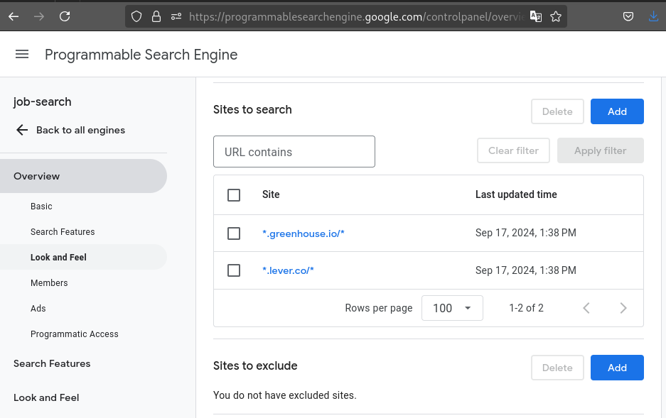

# Job Scraper

Job Scraper is a lightweight Python-based tool designed to scrape job listings from Greenhouse.io and Lever.co and aggregate them into a single, searchable database. Users can clone the repo and run the scraper locally, collecting and contributing job data.


## Features

- Scrape jobs from sources like Lever and Greenhouse.
- Save job information into CSV file(s).
- Supports user-defined preferences for ranking jobs (e.g., prioritizing remote jobs or specific technologies like Python).
- Glassdoor data (e.g., company ratings) collected and saved in a shared CSV file for reuse.
- Lightweight and runs locally.
- Encourages users to contribute to job data by submitting pull requests with additional Glassdoor data they've scraped.


## Getting Started

### Prerequisites

- Python 3.7+
- Required Python packages (see `requirements.txt`)

### Installation

1. Clone the repository:
    ```sh
    git clone https://github.com/rhowell7/job-scraper.git
    cd job-scraper
    ```
2. Set up a virtual environment and install dependencies:
    ```sh
    python -m venv venv
    source venv/bin/activate  # `deactivate` when finished
    pip install -r requirements.txt
    ```

3. Copy the example environment file and add your API key and Custom Search Engine ID:
    ```sh
    cp .env.example .env
    ```
    Then open `.env` in your editor and fill in:
    - `GOOGLE_API_KEY`: Your [Google API key](https://console.cloud.google.com/apis/credentials)
    - `GOOGLE_CSE_ID`: Your [Google Custom Search Engine ID (cx)](https://programmablesearchengine.google.com/controlpanel/all)

    > Tip: You must enable the "Custom Search API" for your Google Cloud project in the [API Library](https://console.cloud.google.com/apis/library). This project assumes the search sites are limited to Greenhouse and Lever.


4. Run the scraper:
    ```sh
    python main.py
    ```
5. View the results in `job_results.csv`. View logs in `logs/job_scraper.log`.


### Configuration

If you wish to modify the search query, edit the `query` parameters in `main.py:698-706`.

If you wish to customize the ranking system, edit the preferences dictionary (`main.py:39-52`) to adjust scoring based on keywords.


### Data Storage

- __Job Results:__ The results of job scraping are saved to `job_results.csv`. This file stores details such as:

    - `company_name`: The company offering the job.
    - `job_title`: The job title.
    - `their_thing`: Placeholder for the company's product or service.
    - `date_first_seen`: The first date the job was scraped.
    - `app_deadline`: Placeholder for the application deadline.
    - `salary_min` and `salary_max`: Salary range extracted from the - `job description, if available.
    - `location`: Job location.
    - `url`: The job posting URL.
    - `rating`, `reviews`,  `company_size`, `glassdoor_url`: Glassdoor information (if available).
    - `found_by`: Where the job was found (job-scraper)
    - `score`: The computed score based on preferences.
    - `preference_hits`: Which preferences were matched.
    - `keywords`: Extracted keywords from the job description.

- __Glassdoor Data:__ The project uses a CSV file called `glassdoor_data.csv` to store company ratings, number of reviews, company size, and Glassdoor URLs.


## Testing

To run the tests, first install the required dependencies:
```sh
source venv/bin/activate  # if not already activated
pip install -r requirements.txt
```

Then, run the tests with `tox`:
```sh
tox
```

Or, run the tests one by one after activating the virtual environment:
```sh
source venv/bin/activate  # if not already activated
pytest
flake8
black --check .
```

__Testing Notes:__
- Set the mandatory minimum test coverage in `pyproject.toml` under `[tool.pytest.ini_options]`
- Set the line length for `black` in `pyproject.toml` under `[tool.black]`
- Set `flake8`'s line-length, ignores, and excludes in `.flake8`
- `setup.py` is ignored in the coverage report as defined in `.coveragerc`


## Contributing

If you've scraped additional job data or improved the scraper in some way, please submit a pull request! To add your results to the repo:

1. Run the scraper to collect job listings.
2. Please make sure `tox` passes all tests before submitting.
3. Commit your changes and submit a pull request.


## Roadmap

- Add support for more job sources.
- Add more robust error handling for edge cases where job pages are formatted differently.
- Introduce user-friendly front-end features for non-technical users to run the tool.


## License

This project is licensed under the MIT License. See the [LICENSE](LICENSE) file for details.
